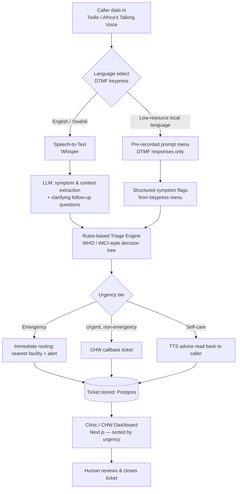

# A Voice-First Medical Intake & Routing Agent

> A phone-call-based AI agent that intakes patient symptoms over voice, applies structured triage logic, and routes the caller (like a support ticket) to the right resource — self-care advice, a community health worker (CHW) callback, the nearest clinic, or emergency referral.

**This is a triage/routing system, not a diagnostic tool.** The AI's role is limited to natural-language symptom extraction and conversation; the actual urgency decision is made by an inspectable, rules-based decision tree, and every ticket is closed by a human at a clinic or CHW level.

---

## 1. Problem Statement

Sub-Saharan Africa carries a disproportionate share of global disease burden relative to its clinical workforce. Africa has 2.3 healthcare workers per 1,000 population, compared with 24.8 per 1,000 in the Americas — only 1.3% of the world's health workers serve a population carrying 25% of the global disease burden [1]. WHO's regional modelling projects a needs-based shortage of 6.1 million health workers across the WHO African Region by 2030, with current supply covering less than half of projected need [2][3]. WHO's Regional Director for Africa has linked this shortage directly to the difficulty of tackling maternal and infant mortality, infectious disease, and even basic services like vaccination [4].

At the same time, mobile phone access — specifically voice, not smartphone data — is the most universal digital channel available on the continent. Sub-Saharan Africa's mobile subscriber penetration sits around 44–52%, still well below the global average of 66%, and feature phones (not smartphones) have historically made up the majority of the region's device base [5][6]. A voice-call interface requires no app install, no data plan, no literacy, and works on the cheapest handset in circulation — which smartphone-app-based health tools structurally exclude.

## 2. Research Gap

Existing digital-health interventions in the region cluster into two categories, and both leave a gap this project targets:

1. **Rigid IVR/USSD systems** (e.g., "press 1 for fever, press 2 for cough") — accessible on any phone, but brittle: they can't handle a caller describing multiple, vague, or compound symptoms in natural speech, and they don't adapt follow-up questions to what the caller has already said.
2. **Smartphone-app symptom checkers** — capable of natural free-text/voice input and LLM-driven follow-up, but implicitly require a smartphone, a data connection, and app literacy — excluding a large share of the population with the highest unmet need (older adults, rural callers, feature-phone users).

**The gap:** there is no widely deployed system that combines (a) the accessibility of a plain voice call on any handset with (b) LLM-driven natural conversation for symptom extraction, while (c) keeping the actual medical urgency decision in a transparent, auditable rules engine rather than an opaque model — a design constraint that matters for both clinical safety and regulatory trust. Precedent exists for AI-assisted decision support multiplying scarce clinical capacity [7], but not, to our knowledge, as a voice-call-native, multi-language, ticket-routing layer built for feature-phone reach.

This project's contribution is that specific combination: **voice-native accessibility + LLM conversation + rules-based safety layer + human-closed ticketing loop**, with an explicit fallback path for low-resource local languages (see §5).

## 3. Competitive Landscape

This is an active space, not an untested idea — which is a strength, not a weakness, for a hackathon pitch. It means the category is validated; the differentiation has to be specific.

| Player | Region | Channel | What it does |
|---|---|---|---|
| **Sauti Care** | Kenya | Voice-first AI triage | Deployed in a hospital setting; reported 87.3% triage concordance and 89.7% top-3 diagnostic accuracy across 10,041 encounters over 22 weeks [8] |
| **Penda Health — AI Consult** | Kenya | Clinician-facing decision support (not patient-facing voice) | Studied in *Nature*; reported 16% reduction in diagnostic errors and 13% reduction in treatment errors across tens of thousands of visits [9] |
| **Tabibu Health** | Kenya | App-based symptom checker | English/Swahili + other local languages, pharmacy/product finder, emergency routing to 999/112, answers grounded in Mayo Clinic/CDC sources [10] |
| **Rocket Health** | Uganda | Phone call, USSD (\*280#), SMS | 24/7 medical call center since 2012, ~40,000 customers, doctors handling phone consultations; reportedly building AI-assisted call triage [11] |
| **Jacaranda Health — PROMPTS** | Kenya | Two-way SMS | Maternal health messaging in Swahili, reaching hundreds of thousands of women [12] |
| **Ada Health** | Global | App-based symptom checker | Free, well-studied, widely used benchmark for general-purpose triage [13] |
| **Gates Foundation + OpenAI — "Horizon1000"** | Rwanda (pan-African rollout planned) | Clinic-deployed AI tools | Up to $50M committed for AI-assisted intake, triage, follow-up, referrals, and local-language medical info across 1,000 clinics by 2028 [14] |

**Where this project still differs:** none of the above foreground a **feature-phone-native, DTMF-fallback path for low-resource local languages** (e.g. Luganda, Runyankole) as a first-class design constraint rather than a future roadmap item. Sauti Care and Tabibu Health assume a smartphone/app or a hospital-grade voice pipeline; Rocket Health's triage is human-staffed, not AI-driven at the call layer; PROMPTS is SMS, not voice. This project's contribution is narrow and specific: a working demonstration that the *same* rules-based triage engine can be reached either through full LLM conversation (English/Swahili) or through a pre-recorded, keypress-only menu (any other local language, any phone) — with no retraining required to add a new language.

## 4. System Architecture



**Design principle:** the LLM sits only in the *conversation and extraction* layer (boxes C, E). It never outputs the final urgency tier directly — that's computed by the deterministic rules engine (box G), which is inspectable, testable, and defensible in front of both judges and, eventually, a real health authority.

### Components

| Layer | Tool | Role |
|---|---|---|
| Voice gateway | Twilio Voice or Africa's Talking Voice API | Answers calls, plays prompts, captures speech/DTMF |
| Speech-to-text | Whisper (or provider STT) | Converts caller speech to text (English/Swahili path only) |
| Conversation/extraction | LLM (Claude/GPT via API) | Extracts symptoms, duration, severity; asks 1–2 clarifying questions |
| Local-language path | Pre-recorded native-speaker audio + DTMF | Structured menu bypassing ASR/TTS gaps (see §5) |
| Triage logic | Hardcoded rules engine (Python/Django) | WHO/IMCI-style decision tree → urgency tier |
| Text-to-speech | TTS provider or pre-generated clips | Reads back next steps to the caller |
| Backend / data store | Django + PostgreSQL | Stores each call as a "ticket": symptoms, tier, status |
| Dashboard | Next.js/React | Clinic/CHW view of open tickets, sorted by urgency |

## 5. Data Flow (per call)

1. Caller dials in → selects language via keypress.
2. **English/Swahili:** free speech → Whisper transcription → LLM extracts symptoms + asks follow-up if needed.
   **Local language:** caller hears pre-recorded symptom prompts → responds via keypress.
3. Structured symptom data passed to the rules engine → urgency tier assigned (Emergency / Urgent / Self-care).
4. Ticket created in Postgres with caller number, symptoms, tier, timestamp, status = "open."
5. Emergency/Urgent tickets trigger a routing action (nearest facility lookup + CHW alert); Self-care tickets get a spoken advice message.
6. Dashboard updates in real time; a human at the clinic/CHW level reviews and closes the ticket.

## 6. Local-Language Handling Strategy

- **English/Swahili:** full LLM pipeline (free speech understood), since STT/TTS coverage is reasonably reliable for these.
- **Other local languages (e.g., Luganda, Runyankole):** ASR/TTS quality is unreliable for these languages, so the system falls back to a **pre-recorded audio menu + DTMF keypress** — no live transcription or synthesis required. A native speaker records ~15–20 short symptom prompts ahead of time; the same rules engine processes the keypress responses.
- This is a deliberate architectural choice, not a limitation to hide: it means **adding a new language only requires recording a prompt set**, not retraining or sourcing a new ASR/TTS model — which is the realistic path to genuine multi-language coverage in this domain today.

## 7. Safety & Scope Notes

- The system never states a diagnosis. Output is limited to an urgency tier and a routing action.
- The rules engine (not the LLM) makes the urgency call, so the logic can be reviewed, tested, and audited independently of model behavior.
- Every ticket is closed by a human — the system augments, not replaces, the CHW/clinic decision.

## 8. References

[1] Shortage of healthcare workers in developing countries — Africa. PubMed. https://pubmed.ncbi.nlm.nih.gov/19484878/

[2] Ballpark Estimates of Budget Space for Health Workforce Investments in the 47 Countries of the WHO African Region: A Modelling Study. PMC. https://pmc.ncbi.nlm.nih.gov/articles/PMC11830165/

[3] Projected health workforce requirements and shortage for addressing the disease burden in the WHO Africa Region, 2022–2030: a needs-based modelling study. BMJ Global Health. https://www.ncbi.nlm.nih.gov/pmc/articles/PMC11789529/

[4] Chronic staff shortfalls stifle Africa's health systems: WHO study. WHO Regional Office for Africa. https://www.afro.who.int/news/chronic-staff-shortfalls-stifle-africas-health-systems-who-study

[5] The Mobile Economy — Sub-Saharan Africa. GSMA Intelligence. https://www.gsma.com/mobileeconomy/wp-content/uploads/2020/03/GSMA_MobileEconomy2020_SSA_Eng.pdf

[6] Feature phones and the renewed drive for internet penetration in Africa. Techpoint Africa. https://techpoint.africa/insight/drive-for-feature-phone-penetration-in-africa/

[7] Addressing Africa's healthcare worker shortage. MamaOpe. https://mamaope.com/news/healthcare-worker-shortage-addressing/

[8] Sauti Care — Voice-First AI Healthcare Triage, Research. https://www.sauticare.com/research

[9] What Makes a Health AI Actually Built for Africa? (Penda Health AI Consult results). DEV Community. https://dev.to/xander-aj3/what-makes-a-health-ai-actually-built-for-africa-4ka9

[10] What Makes a Health AI Actually Built for Africa? (Tabibu Health). DEV Community. https://dev.to/xander-aj3/what-makes-a-health-ai-actually-built-for-africa-4ka9

[11] Uganda's Rocket Health raises $5M to scale telemedicine across Africa. TechCrunch. https://techcrunch.com/2022/03/07/ugandas-rocket-health-raises-5m-in-round-led-by-creadev-to-scale-telemedicine-across-africa

[12] What Makes a Health AI Actually Built for Africa? (Jacaranda Health PROMPTS). DEV Community. https://dev.to/xander-aj3/what-makes-a-health-ai-actually-built-for-africa-4ka9

[13] What Makes a Health AI Actually Built for Africa? (Ada Health). DEV Community. https://dev.to/xander-aj3/what-makes-a-health-ai-actually-built-for-africa-4ka9

[14] Gates Foundation, OpenAI launch $50M AI health initiative targeting 1,000 clinics in Africa. GeekWire. https://www.geekwire.com/2026/gates-foundation-openai-launch-50m-ai-health-initiative-targeting-1000-clinics-in-africa/

---

## 9. Next Steps / Build Order

- [ ] Stand up Django + Postgres ticket schema
- [ ] Wire Twilio/Africa's Talking sandbox voice number
- [ ] Build rules-engine decision tree (WHO/IMCI symptom set)
- [ ] Wire Whisper STT + LLM extraction for English/Swahili path
- [ ] Record local-language prompt set + build DTMF menu path
- [ ] Build Next.js dashboard (ticket list, urgency sort, status update)
- [ ] End-to-end demo run: live call → ticket → dashboard update

---

## 10. Triage Harness & Rules Engine (`triage/` package)

This package covers boxes **E** (the LLM's directives and guardrails) and **G** (the rules engine) of the architecture. It's plain Python with no Django or telephony dependency, and it doesn't depend on any particular LLM provider.

```bash
pip install -e ".[dev]"
pytest -q                      # full test suite
python examples/cli_demo.py    # scripted calls: normal, drift, injection, emergency
```

### How the model is kept on task

| Layer | Where | What it does |
|---|---|---|
| System prompt | `triage/prompts.py` | Intake-only role. The model never diagnoses, never names or doses medicine, and never judges urgency. Replies are short and spoken. It must answer in strict JSON using a closed symptom vocabulary. |
| Caller speech as data | `prompts.wrap_utterance` | Caller words are wrapped in `<caller_utterance>` tags, so "ignore your rules…" is treated as off-topic, not as an instruction. |
| Input guard | `guardrails.check_input` | Danger-sign keywords (English + Swahili) close the call as an **emergency without calling the model**. A danger sign the model picks up later ends the call the same way. |
| Output guard | `guardrails.check_output` | Rejects bad JSON, diagnoses, medication advice, urgency claims, prompt leaks, markdown and over-long replies. A rejected reply gets one corrective retry. If that also fails, a canned safe line is spoken instead, and the valid symptom data is kept. |
| Drift policy | `harness.IntakeSession` | The 1st off-topic turn gets the model's own redirect and the 2nd a firmer canned redirect. The 3rd ends the call with a health-worker callback. Calls also end after at most 6 turns. |
| Rules engine | `triage/rules/` | The urgency tier comes **only** from the deterministic rules, never from the model. Every matched rule id is stored for audit. |
| Fail safe | `rules.py` | If there's no usable data, the symptoms aren't recognised, or the intake didn't finish (hang-up, drift, turn cap, model failure), the call goes to Urgent / CHW callback, never to self-care. |

### Integration

```python
from triage import IntakeSession, decide, report_from_keypresses

class MyLLM:                                    # wrap any provider
    def complete(self, system: str, messages: list[dict]) -> str: ...

session = IntakeSession(MyLLM(), clinic_name="the community health line")
tts(session.opening_line())
while True:
    result = session.handle_utterance(stt(caller_audio))
    tts(result.reply_text)
    if result.done:                             # result.emergency -> trigger routing now
        break
ticket = session.finalize().to_dict()           # report, decision, closed_reason, transcript -> Postgres
# If the caller hangs up early, call session.finalize() anyway.

# Local-language keypress path uses the same engine:
decision = decide(report_from_keypresses({"age_group": "2", "fever": "1", "duration": "3"}))
```

`triage.dtmf.MENU` holds the question script for recording the local-language prompts.

### Testing with a local model

`triage.adapters.OllamaClient` runs the harness against a model served by [Ollama](https://ollama.com). It uses no extra Python dependencies. The request pins the output to the `LLMTurn` JSON schema, so the model can't return malformed JSON and retries are rare.

```bash
ollama pull qwen3:8b
python examples/local_chat.py                            # type as the caller; shows latency per turn
python examples/local_chat.py --model gemma3:12b --omit-think
```

**Recommended model for a 16 GB GPU (the team's Alienware desktop, RTX 4080 Super):**

| Model | VRAM (Q4) | Why |
|---|---|---|
| **`qwen3:8b`** (default) | ~5–6 GB | Fast. It follows JSON and system rules well and supports Swahili. It leaves room for Whisper on the same GPU. The adapter sends `think: false` to turn off its reasoning mode, which would otherwise add seconds to every turn. |
| `gemma3:12b` | ~8 GB | Try it if Swahili replies from Qwen are weak. It's stronger at multilingual and a bit slower. Run it with `--omit-think`. |

Avoid reasoning models and anything above ~14B parameters. Reasoning adds latency, and larger models crowd out Whisper (large-v3-turbo needs ~2–3 GB).

### Voice test with Whisper

`examples/voice_chat.py` tests the full voice loop on one PC, before the phone line exists. You talk into the mic, `faster-whisper` transcribes it on the GPU, the harness and local model answer, and the reply is read aloud.

**What's needed**

| Piece | What | Notes |
|---|---|---|
| Speech-to-text | [`faster-whisper`](https://github.com/SYSTRAN/faster-whisper), model `large-v3-turbo`, float16 | About 2–3 GB VRAM, so it fits alongside `qwen3:8b` on 16 GB. Tuned for speed: greedy decoding (`beam_size=1`), silence trimming (`vad_filter`), fixed language (no auto-detect). |
| CUDA libraries | cuBLAS 12 + cuDNN 9 | `pip install nvidia-cublas-cu12 nvidia-cudnn-cu12`. The script adds their folders to the DLL path itself, so no manual PATH editing is needed on Windows. |
| Microphone | `sounddevice` + `numpy` | 16 kHz mono, push-to-talk. |
| Text-to-speech | `pyttsx3` | Uses the offline Windows voices. It's only a stand-in for the phone provider's TTS. Use `--no-tts` to print replies instead. |
| LLM | Ollama + `qwen3:8b` | See above. |

```bash
pip install -e ".[voice]"
pip install nvidia-cublas-cu12 nvidia-cudnn-cu12
ollama pull qwen3:8b
python examples/voice_chat.py                    # English
python examples/voice_chat.py --language sw      # Swahili
python examples/voice_chat.py --device cpu --whisper-model small   # no GPU
```

Each turn prints how long speech-to-text and the LLM took, and the ticket is printed at the end. Whisper's Swahili is usable but weaker than its English, and it doesn't support Luganda or Runyankole. Those languages go through the keypad path (`triage/dtmf.py`).

> **Clinical content is placeholder.** The rules in `triage/rules/rules.py` are loosely modelled on WHO IMCI danger signs for the demo. The Swahili red-flag phrases and all canned lines need review by a clinician and native speakers before any real use.
